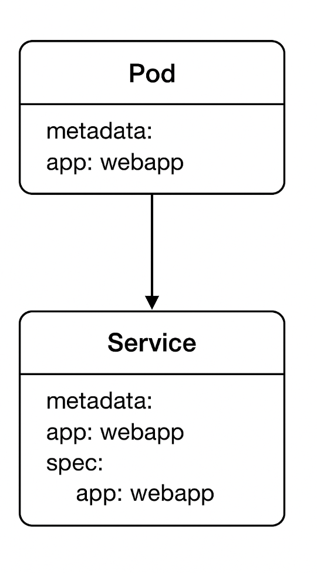

# Pods

Pods are just the wrappers for containers

Generally its always one container per pod , but genrally few times its more as a helper container like ingesting logs or metrics of the main container.
eg:


## Writing a Pod Spec

apiVersion: v1
kind: Pod
metadata:
    name: myapp-pod
    labels:
        app: myapp
spec:
    containers:
    - name: nginx


## writing pod file for the course
apiVersion: v1
kind: Pod
metadata:
    name: webapp
spec: 
    containers:
    - name: webapp
      image: richardchesterwood/k8s-fleetman-webapp-angular:release0


## Error faced  Pod status: CrashLoopBackOff


Kubernetes starts your container, it crashes/exits, and Kubelet keeps trying to restart it, but each time it fails again, so Kubernetes backs off (waits longer and longer) before the next restart.

RCA - Got this error coz the image didn't supported the same architecture.

Solution: got into the docker hub of it and found the right multi arch image and updated the pod file.


## Exec into the pod
Since its a single container pod we can exec into it using below command
Note: use the Help if not sure about the command

``` bash
k exec -it <pod Name> -- Command (eg: /bin/bash)
```

```bash
k exec -it webapp -- Date
k exec -it webapp -- bash
```

## Get the pods with labels 
``` bash
k get po --show-labels
k get po -l app=webapp # -l is for label filtering
```


## Concept of labels and Selectors



**Labels** are key/value pairs that are attached to objects, such as pods. Labels are intended to be used to specify **identifying attributes** of objects that are meaningful and relevant to users.

**Selectors** are used to filter a list of resources based on their labels. They allow users to **select a subset of resources** that match certain criteria.


