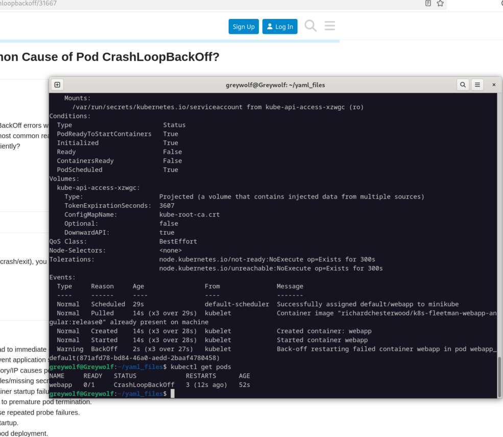

# Pods

Pods are just the wrappers for containers

Generally its always one container per pod , but genrally few times its more as a helper container like ingesting logs or metrics of the main container.
eg:

## Writing a Pod Spec

apiVersion: v1
kind: Pod
metadata:
    name: myapp-pod
    labels:
        app: myapp
spec:
    containers:
    - name: nginx

## writing pod file for the course
apiVersion: v1
kind: Pod
metadata:
    name: webapp
spec: 
    containers:
    - name: webapp
      image: richardchesterwood/k8s-fleetman-webapp-angular:release0

## Error faced  Pod status: CrashLoopBackOff

Kubernetes starts your container, it crashes/exits, and Kubelet keeps trying to restart it, but each time it fails again, so Kubernetes backs off (waits longer and longer) before the next restart.

Got this error coz the image didn't supported the same architecture.