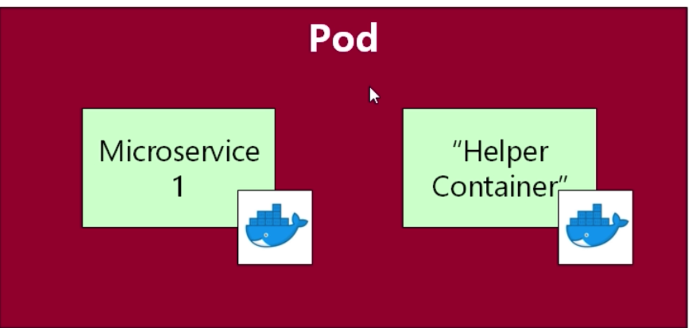

# Pods

Pods are just the wrappers for containers

Generally its always one container per pod , but genrally few times its more as a helper container like ingesting logs or metrics of the main container.
eg:
