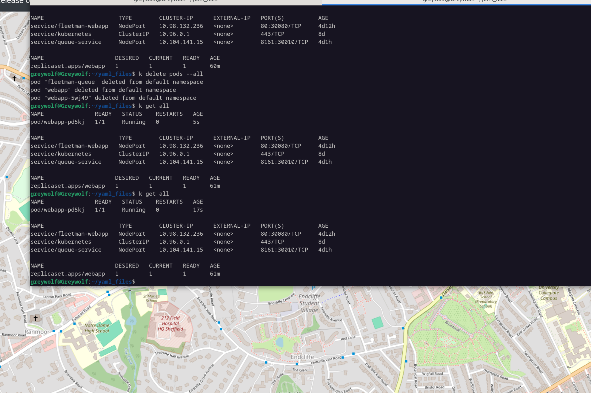

# Replica Set 
## replicaSet in kubernetes or rs
1. It is an extra piece of configuration to ensure that the Kubernetes pods are always running for the desired number of replicas.

## Points to remember
- ReplicaSet is a higher-level abstraction that manages multiple instances of a pod.
- it has 3 new keys
    - template: pod template that defines the pod's configuration (inside spec)
    - selector: label selector to identify the pods managed by the ReplicaSet (match labels for which we are applying pod)
    - replicas: number of desired pod instances


``` yaml 
apiVersion: apps/v1
kind: ReplicaSet
metadata: 
    name: webapp
spec:
    replicas: 1
    selector:
        matchLabels:
            app: webapp #this  should match
    template:
        metadata:
            labels:
                app: webapp #this  should match
        spec:
            containers:
            - name: webapp
              image: nginx

```
    

## Note 
Pods created by ReplicaSet will have a unique suffix added to their names for identification.
like webapp-xxxxx


## Testing it
1. I deleted all the pods using k delete po --all
2. It swapped to 0/1 pods
3. It spawned the new pods with new suffix within seconds


