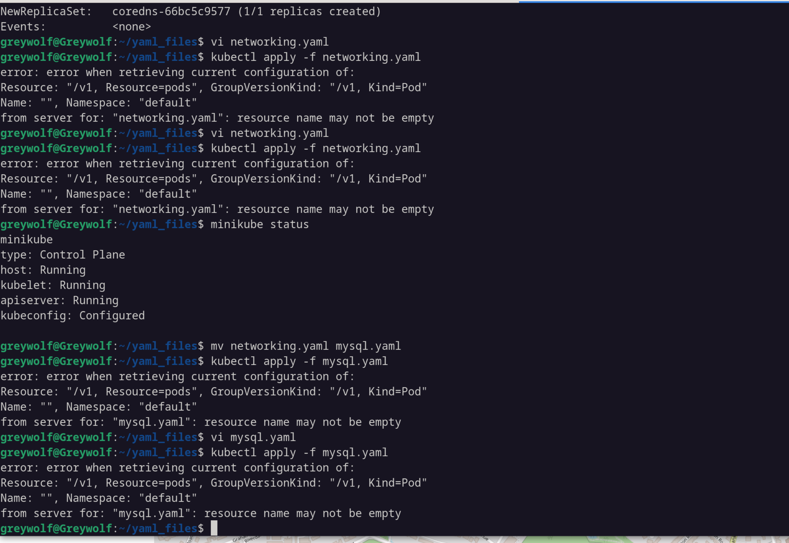

# RCA: “resource name may not be empty”



## Issue:
`kubectl apply -f <file>` returned:
```
error: resource name may not be empty.
```

## Root Cause:
The metadata field in the YAML manifest was misspelled. Because metadata was incorrect, Kubernetes could not read `metadata.name`, resulting in an empty resource name.

## How the issue was identified:
- The error referenced `Resource=pods`, meaning Kubernetes parsed the file as a Pod manifest.
- Pods require `metadata.name`.
- The error persisted even after renaming the file, which pointed to malformed YAML rather than content type.
- This strongly suggested Kubernetes could not find `metadata.name`, which typically happens when `metadata:` is misspelled or incorrectly indented.
- You confirmed that `metadata` was indeed misspelled.

## Impact:
- Kubernetes was unable to create or update the resource.
- Deployment was blocked until YAML was corrected.

## Fix:
- Corrected the spelling of `metadata:` and ensured a valid `metadata.name` exists.

## Prevention:
- Use `kubectl apply --dry-run=client` to catch manifest issues early.
- Enable YAML validation in your editor (VSCode Kubernetes/YAML extensions).
